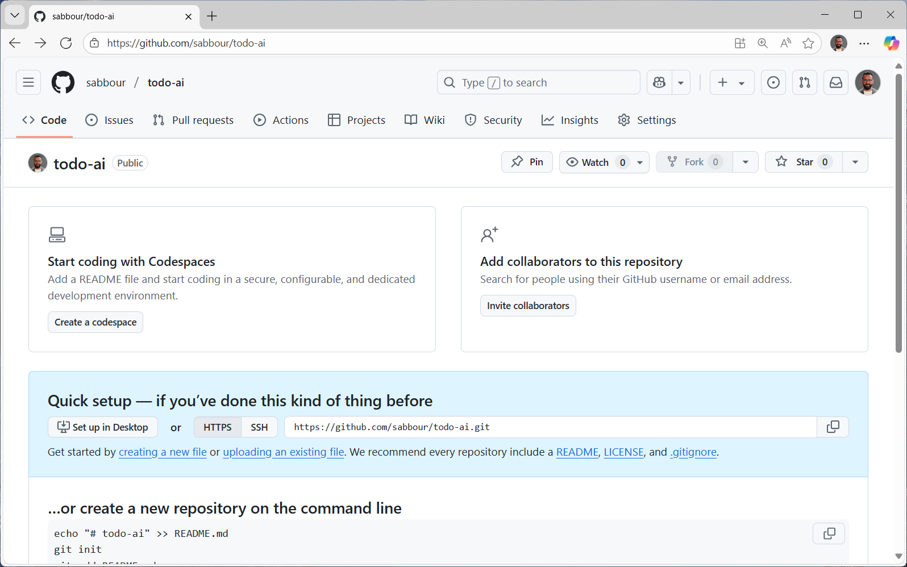
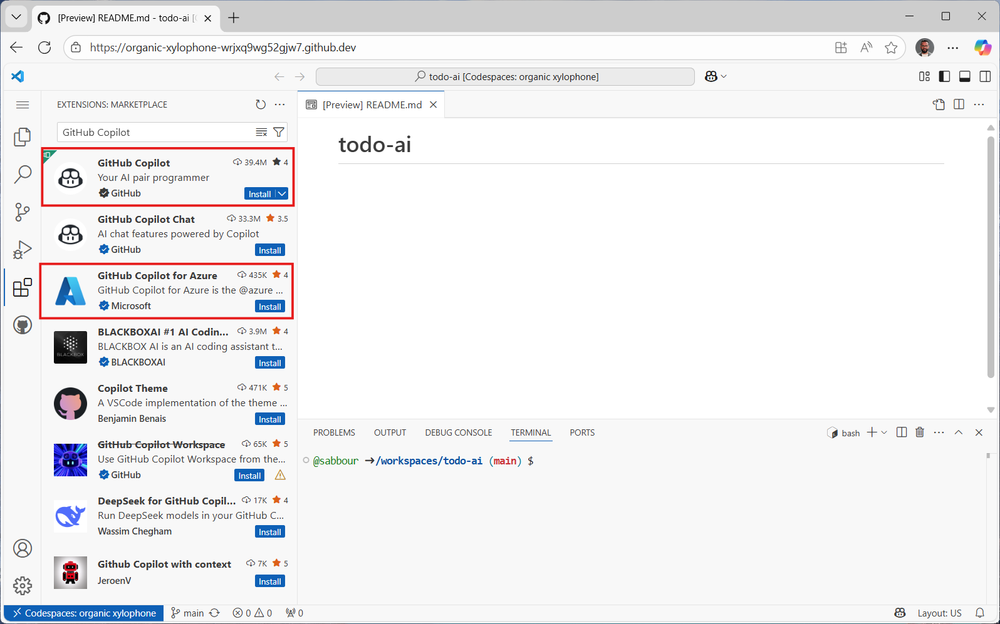
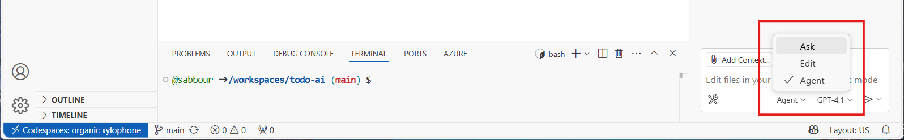
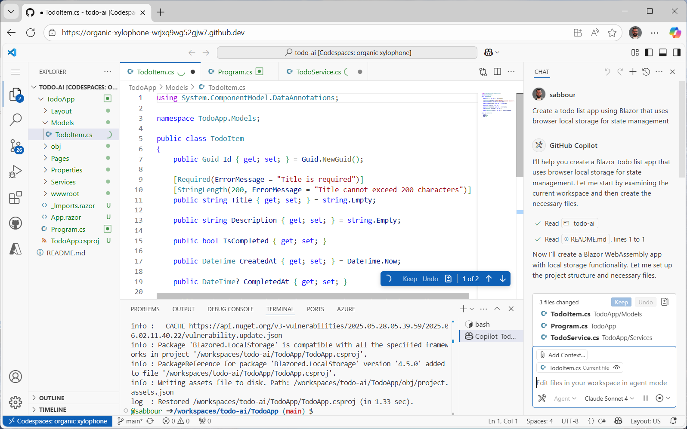
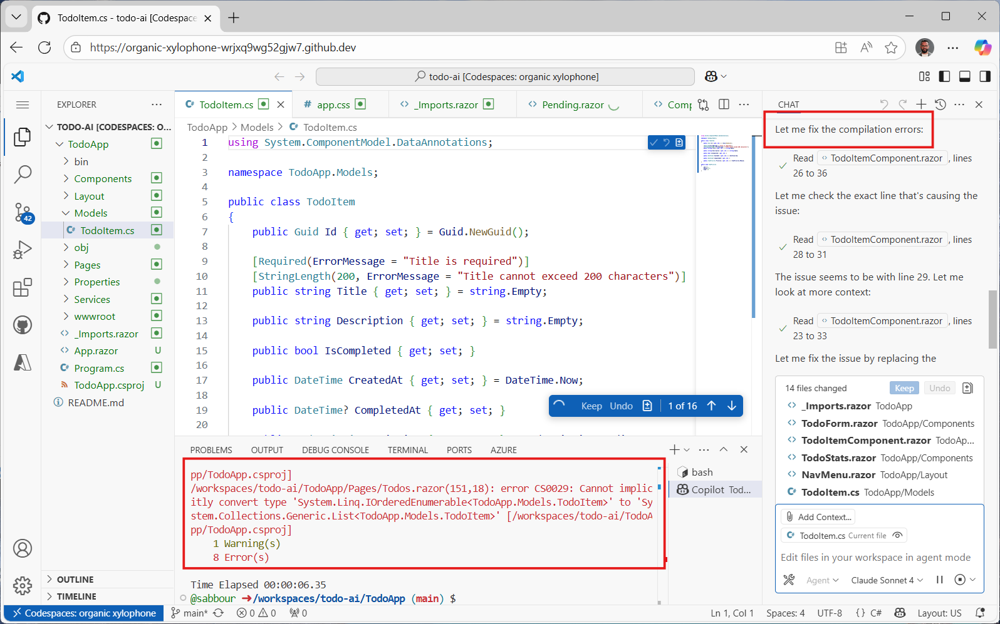
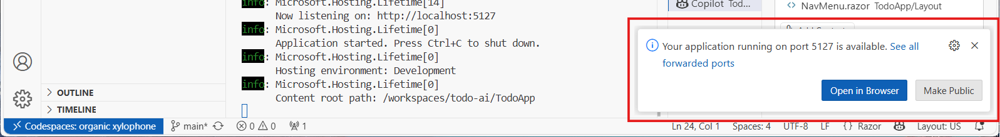
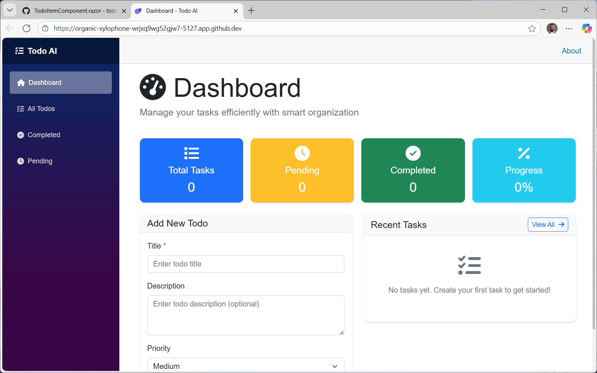

## Background

Modern AI-powered development tools like GitHub Copilot Edit in Agent mode are transforming how developers build applications, providing assistance from code generation to infrastructure creation. Meanwhile, Kubernetes deployment workflows often involve complex setup for containers and authentication to external services.

AKS Automatic simplifies this by offering a developer-first experience that abstracts cluster complexity while maintaining enterprise security. Combined with automated deployments and workload identity, developers can focus on building applications rather than managing infrastructure.

In this post, we'll demonstrate an end-to-end workflow using GitHub Copilot and AKS Automatic to go from a blank repository to a running AI application in production.


## Setting up the development environment with GitHub Codespaces

To begin, [create a new, blank repository on GitHub](https://github.com/new). Next, launch a GitHub Codespace from your repository by clicking on **Create a codespace**.




Within moments, you'll have a fully provisioned, containerized development environment accessible directly in your browser. This environment includes:

- Visual Studio Code with access to the full extension marketplace
- Integrated GitHub Copilot for AI-powered code generation
- Built-in terminal for running commands and scripts
- Pre-installed tools like Git and Docker, with the ability to add language runtimes as needed

Install the GitHub Copilot and GitHub Copilot for Azure extensions.




## Building an AI application with GitHub Copilot Edit

With the development environment ready, the next step is to build the AI application. GitHub Copilot Edit in Agent mode is a powerful tool that assists in generating code based on natural language prompts and context from your project. If you don't yet have a Copilot subscription, you can use Copilot for free by signing up for the [Copilot Free plan](https://github.com/github-copilot/signup) and get a monthly limit of completions and chat interactions. 

Copilot Chat lets you interact with GitHub Copilot by using natural language, to ask and receive answers to coding-related questions. The GitHub Copilot chat interface should be already open, if not, you can open it via `Ctrl + Alt + I`. Start an agentic coding flow to let Copilot autonomously plan and execute the tasks that are needed to complete your request. These tasks can involve editing code but also include running commands in the terminal. In agent mode, Copilot might invoke different tools to accomplish the task.

In the Chat view, select **Agent** from the chat mode dropdown.



### Create a starter application from an idea:

1. **Define the application requirements**: Start by outlining the functionality of your application. For example, you might want to create a chatbot, a recommendation system, or a data analysis tool.

2. **Use Copilot Edits in Agent mode**: In the GitHub Copilot Chat interface, describe the desired functionality in natural language. For instance:
   ```
   Create a todo list app using Blazor that uses browser local storage for state management
   ```
   GitHub Copilot Edit in Agent mode will suggest and refine code snippets to implement the functionality. Accept or modify the suggestions as needed directly in the chat interface. It will even create a user interface with CSS styles.

   

3. **Build the application**: Use the built-in terminal in Codespaces to build your application. For example:
   ```bash
   dotnet build
   ```

   Verify that the application builds as expected. If there are any compilation errors, GitHub Copilot will look into the errors and iterate on changes to fix them.

   

4. **Run the application**: Use the built-in terminal in Codespaces to run and test your application. For example:
   ```bash
   dotnet run
   ```

   Once the app is up and running, you can launch the browser by clicking on **Open in Browser**.
   

   You should now be presented with the interface of your freshly minted to-do application.
   

By leveraging GitHub Copilot Edit in Agent mode, you can rapidly prototype and build your Blazor-based todo list application with minimal manual coding. This approach not only saves time but also allows you to focus on the high-level design and functionality of your application.


## Iterate and refine by adding new functionality that uses Azure OpenAI

Continue interacting with the Copilot Chat interface to add features, handle edge cases, and improve the application. For example, let's add components to automatically generate a category each task using Azure OpenAI.
   ```
   Add an automatically generated category for each task. Use Azure OpenAI to generate the category from the task description. Authenticate using using workload identity.

   Assume the workload identity and Azure OpenAI configuration will come from the following environment variables:
   - AZURE_TENANT_ID
   - AZURE_OPENAI_CLIENTID
   - AZURE_OPENAI_ENDPOINT
   ```

## Generate a Dockerfile and build the image

To containerize your Blazor-based todo list application, you can use GitHub Copilot to generate a Dockerfile. This Dockerfile will define the environment and instructions needed to build and run your application in a container.

### Steps to Generate and Build:

1. **Generate the Dockerfile**:
   In the GitHub Copilot Chat interface, describe the desired Dockerfile. For example:
   ```
   Create a Dockerfile for a Blazor WebAssembly app. Use the official .NET SDK image for building and the .NET runtime image for running the app.
   ```
   Copilot will generate a Dockerfile.

2. **Build the Docker Image**:
   Use the built-in terminal in Codespaces to build the Docker image. Run the following command:
   ```bash
   docker build -t todo-list-app .
   ```

3. **Verify the Image**:
   After building the image, verify that it works as expected by running it locally:
   ```bash
   docker run -p 5000:80 todo-list-app
   ```
   Access the application in your browser at `http://localhost:5000` to ensure it runs correctly.

By containerizing your application, you make it portable and ready for deployment to AKS Automatic or any other container orchestration platform.

## Deploying to AKS Automatic with automated deployments

### What is Automated Deployments?

Automated Deployments in AKS Automatic simplifies the process of deploying containerized applications to Azure Kubernetes Service. It integrates seamlessly with your GitHub repository to automatically generate Kubernetes manifests, configure secure connections, and deploy your application with minimal manual intervention. This feature is designed to provide a developer-first experience, enabling you to focus on building applications rather than managing infrastructure.

### Steps to Deploy:

1. **Connect Your GitHub Repository**:
   - Navigate to the Azure portal and select your AKS cluster.
   - Under the "Automated Deployments" section, click "Set up deployment."
   - Authenticate with your GitHub account and select the repository containing your application code.

   

2. **Configure Deployment Settings**:
   - Specify the branch to deploy from (e.g., `main`).
   - Review and customize the generated Kubernetes manifests if needed.
   - Set up environment variables required for your application, such as:
     - `AZURE_TENANT_ID`
     - `AZURE_OPENAI_CLIENTID`
     - `AZURE_OPENAI_ENDPOINT`

   

3. **Deploy the Application**:
   - Click "Deploy" to start the deployment process.
   - Monitor the deployment status in the Azure portal.

   

   - **Add a Service Connector**: After deployment, navigate to the "Service Connectors" section in the Azure portal. Add a Service Connector to securely connect your application to Azure OpenAI. During this step, specify the following environment variables:
     - `AZURE_TENANT_ID`
     - `AZURE_OPENAI_CLIENTID`
     - `AZURE_OPENAI_ENDPOINT`

By leveraging Automated Deployments and Service Connectors, you can streamline the deployment process and ensure that your application is securely and efficiently deployed to AKS Automatic.

## Configuring Service Connector for secure Azure OpenAI access

To securely connect your application to Azure OpenAI, you can use the Service Connector feature in Azure. This simplifies the process of managing credentials and ensures secure communication between your application and Azure services.

### Steps to Configure the Service Connector:

1. **Navigate to the Azure Portal**:
   - Open the Azure portal and go to your AKS cluster.

2. **Add a Service Connector**:
   - Under the "Service Connectors" section, click "Add Service Connector."
   - Select "Azure OpenAI" as the target service.

3. **Configure Authentication**:
   - Choose "Workload Identity" as the authentication method.
   - Ensure that your AKS cluster is configured with workload identity.

4. **Set Environment Variables**:
   - During the Service Connector setup, specify the following environment variables:
     - `AZURE_TENANT_ID`: Your Azure Active Directory tenant ID.
     - `AZURE_OPENAI_CLIENTID`: The client ID for your Azure OpenAI resource.
     - `AZURE_OPENAI_ENDPOINT`: The endpoint URL for your Azure OpenAI resource.

5. **Apply the Configuration**:
   - Save and apply the Service Connector configuration. This will automatically inject the environment variables into your application pods.

6. **Verify the Connection**:
   - Test the connection to Azure OpenAI from your application to ensure that it is working as expected.

By using the Service Connector, you can securely and efficiently connect your application to Azure OpenAI without manually managing sensitive credentials.

