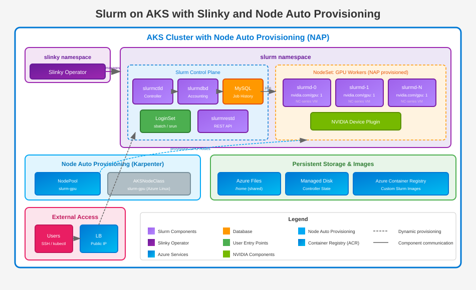

High performance computing (HPC) teams and AI/ML researchers often rely on [Slurm](https://slurm.schedmd.com/documentation.html), a powerful open-source workload manager used extensively across supercomputers and large compute clusters. If your organization already uses Kubernetes for inference workloads or web applications, running Slurm on AKS lets teams continue using a familiar interface while benefiting from cloud-native infrastructure.

This guide uses [Slinky](https://slinky.ai/), SchedMD's official project for running Slurm natively on Kubernetes. Slinky provides a Kubernetes operator that manages Slurm components through Custom Resource Definitions (CRDs), making deployment and lifecycle management significantly simpler than manual approaches.

<!-- truncate -->

## Why run Slurm on Kubernetes?

Running Slurm on Kubernetes might seem counterintuitive since both are workload orchestrators. However, there are compelling reasons to combine them:

- **Unified infrastructure**: Avoid splitting scarce resources like GPUs between separate Slurm clusters on VMs and Kubernetes clusters. Consolidate everything on AKS.
- **Familiar interface for HPC teams**: Teams already using Slurm can continue submitting jobs with `sbatch` and `srun` while platform teams manage the underlying Kubernetes infrastructure.
- **Cloud-native benefits**: Take advantage of AKS features like autoscaling, managed identity, and Azure Monitor integration.
- **Gradual Kubernetes adoption**: Help HPC teams learn Kubernetes concepts gradually without disrupting existing workflows.

> **Note**: This guide focuses on AI/ML workloads. For traditional HPC scenarios requiring advanced Slurm features, consider purpose-built solutions like [Azure CycleCloud](https://learn.microsoft.com/azure/cyclecloud/overview).

## What is Slinky?

[Slinky](https://slinky.schedmd.com/) is SchedMD's set of projects enabling interoperability between Slurm and Kubernetes. The key component is the **slurm-operator**, which provides:

- **Custom Resource Definitions (CRDs)**: Define Slurm clusters, NodeSets, and LoginSets declaratively
- **Automated lifecycle management**: The operator handles component coordination, upgrades, and graceful shutdowns
- **NodeSets**: Homogeneous sets of Slurm worker nodes that integrate with Kubernetes autoscaling
- **LoginSets**: Managed login nodes for job submission
- **Workload-aware scaling**: The operator considers running Slurm jobs before scaling in or draining nodes

## Architecture overview

The Slinky deployment on AKS consists of several components:

- **Slurm Operator**: Runs in the `slinky` namespace and manages all Slurm components
- **Slurm Controller (slurmctld)**: Schedules jobs and manages cluster state
- **Slurm Database Daemon (slurmdbd)**: Handles job accounting and connects to the database
- **Database**: Azure Database for MySQL flexible server for job accounting
- **NodeSets**: Worker nodes (`slurmd`) that execute jobs, including GPU-enabled nodes
- **LoginSets**: Entry points for users to submit jobs via SSH
- **Shared storage**: Azure Files for user home directories



## Prerequisites

Before you begin, ensure you have:

- [Azure CLI](https://learn.microsoft.com/cli/azure/install-azure-cli) version 2.61.0 or later
- [kubectl](https://kubernetes.io/docs/tasks/tools/) configured to access your cluster
- [Helm](https://helm.sh/docs/intro/install/) version 3 or later
- An Azure subscription with sufficient quota for GPU VMs (NC, ND, or NV series)

## Step 1: Create the AKS cluster

Set the following environment variables for use throughout this guide:

```bash
export RESOURCE_GROUP="aks-slurm-rg"
export CLUSTER_NAME="aks-slurm-cluster"
export LOCATION="swedencentral"
export VNET_NAME="aks-slurm-vnet"
```

Create a resource group:

```bash
az group create --name $RESOURCE_GROUP --location $LOCATION
```

Create a virtual network with a subnet for AKS nodes:

```bash
# Create VNet
az network vnet create \
  --resource-group $RESOURCE_GROUP \
  --name $VNET_NAME \
  --address-prefix 10.0.0.0/8 \
  --subnet-name aks-subnet \
  --subnet-prefix 10.240.0.0/16

# Get the AKS subnet ID
AKS_SUBNET_ID=$(az network vnet subnet show \
  --resource-group $RESOURCE_GROUP \
  --vnet-name $VNET_NAME \
  --name aks-subnet \
  --query id -o tsv)
```

Create an AKS cluster with Node Auto Provisioning (NAP) and Workload Identity enabled:

```bash
az aks create \
  --resource-group $RESOURCE_GROUP \
  --name $CLUSTER_NAME \
  --location $LOCATION \
  --node-provisioning-mode Auto \
  --network-plugin azure \
  --network-plugin-mode overlay \
  --network-dataplane cilium \
  --vnet-subnet-id $AKS_SUBNET_ID
```

This command creates an AKS cluster with:

- **Node Auto Provisioning (NAP)**: Automatically provisions nodes based on workload requirements using Karpenter
- **Azure CNI Overlay with Cilium**: Modern networking with improved pod density and network policies

Get credentials to connect to the cluster:

```bash
az aks get-credentials --resource-group $RESOURCE_GROUP --name $CLUSTER_NAME
```

Verify the cluster is running:

```bash
kubectl get nodes
```

Expected output (system nodes for the control plane components):

```text
NAME                                STATUS   ROLES    AGE     VERSION
aks-nodepool1-12345678-vmss000000   Ready    <none>   3m      v1.33.5
aks-nodepool1-12345678-vmss000001   Ready    <none>   3m      v1.33.5
aks-nodepool1-12345678-vmss000002   Ready    <none>   3m      v1.33.5
```

> **Note**: These are the system nodes created with the cluster. Slurm worker nodes are provisioned on-demand by NAP when you deploy NodeSets in later steps.

## Step 2: Configure Node Auto Provisioning for GPU workers

Node Auto Provisioning (NAP) uses Karpenter to automatically provision GPU nodes for your Slurm workloads.

### Create NodePool for GPU workers

```bash
kubectl apply -f - <<EOF
apiVersion: karpenter.sh/v1
kind: NodePool
metadata:
  name: slurm-gpu
spec:
  template:
    spec:
      nodeClassRef:
        group: karpenter.azure.com
        kind: AKSNodeClass
        name: slurm-gpu
      requirements:
        - key: kubernetes.io/arch
          operator: In
          values: ["amd64"]
        - key: kubernetes.io/os
          operator: In
          values: ["linux"]
        - key: karpenter.azure.com/sku-gpu-manufacturer
          operator: In
          values: ["nvidia"]
        - key: karpenter.sh/capacity-type
          operator: In
          values: ["on-demand","spot"]
      taints:
        - key: nvidia.com/gpu
          effect: NoSchedule
  limits:
    nvidia.com/gpu: 100
  disruption:
    consolidationPolicy: WhenEmptyOrUnderutilized
    consolidateAfter: 10m
---
apiVersion: karpenter.azure.com/v1beta1
kind: AKSNodeClass
metadata:
  name: slurm-gpu
spec:
  imageFamily: AzureLinux
  osDiskSizeGB: 256
EOF
```

> **Tip**: To target specific GPU types, add `karpenter.azure.com/sku-gpu-name` with values like `A100`, `H100`, or `T4`. See the [NAP documentation](https://learn.microsoft.com/azure/aks/node-auto-provisioning-node-pools) for all available selectors.

### Install the NVIDIA device plugin

AKS automatically installs NVIDIA GPU drivers on GPU-enabled nodes, but you need to install the [NVIDIA device plugin](https://github.com/NVIDIA/k8s-device-plugin) for Kubernetes to discover and schedule GPUs. The device plugin exposes GPUs as the `nvidia.com/gpu` resource that pods can request.

```bash
kubectl apply -f https://raw.githubusercontent.com/NVIDIA/k8s-device-plugin/main/deployments/static/nvidia-device-plugin.yml
```

Verify the device plugin DaemonSet is created:

```bash
kubectl get daemonset -n kube-system nvidia-device-plugin-daemonset
```

Expected output:

```text
NAME                             DESIRED   CURRENT   READY   UP-TO-DATE   AVAILABLE   NODE SELECTOR   AGE
nvidia-device-plugin-daemonset   0         0         0       0            0           <none>          10s
```

> **Note**: The DESIRED count shows 0 because no GPU nodes exist yet. When NAP provisions GPU nodes for Slurm worker pods, the device plugin automatically runs on those nodes and exposes the GPUs.

Verify the NodePools are ready:

```bash
kubectl get nodepools
```

Expected output:

```text
NAME           NODECLASS      NODES   READY   AGE
default        default        0       True    6m
slurm-gpu      slurm-gpu      0       True    1m
system-surge   system-surge   0       True    6m
```

> **Note**: NAP creates `default` and `system-surge` NodePools automatically. Nodes show as 0 initially because NAP provisions nodes on-demand when pods request them.

## Step 3: Install cert-manager

The Slinky operator uses [Kubernetes admission webhooks](https://kubernetes.io/docs/reference/access-authn-authz/admission-controllers/) to validate and mutate Slurm custom resources. These webhooks require TLS certificates for secure communication with the Kubernetes API server.

[cert-manager](https://cert-manager.io/) automates the creation, renewal, and management of these TLS certificates. Without cert-manager, you would need to manually generate and rotate certificates for the Slinky webhook endpoints.

```bash
helm repo add jetstack https://charts.jetstack.io
helm repo update

helm install cert-manager jetstack/cert-manager \
  --set 'crds.enabled=true' \
  --namespace cert-manager \
  --create-namespace
```

Verify cert-manager is running:

```bash
kubectl get pods -n cert-manager
```

Expected output:

```text
NAME                                       READY   STATUS    RESTARTS   AGE
cert-manager-5c6866597-zrnbq               1/1     Running   0          1m
cert-manager-cainjector-577f6d9fd7-lnkhm   1/1     Running   0          1m
cert-manager-webhook-787858fcdb-nlzsq      1/1     Running   0          1m
```

## Step 4: Install the Slinky operator

Install the Slinky operator CRDs and the operator itself:

```bash
# Install CRDs
helm install slurm-operator-crds \
  oci://ghcr.io/slinkyproject/charts/slurm-operator-crds

# Install the operator
helm install slurm-operator \
  oci://ghcr.io/slinkyproject/charts/slurm-operator \
  --namespace slinky \
  --create-namespace
```

Verify the operator is running:

```bash
kubectl get pods -n slinky
```

Expected output:

```text
NAME                                      READY   STATUS    RESTARTS   AGE
slurm-operator-5d86d75979-6wflf           1/1     Running   0          1m
slurm-operator-webhook-567c84547b-kr7zq   1/1     Running   0          1m
```

## Step 5: Deploy MySQL for job accounting

Slurm uses a database for job accounting, which enables tracking job history, resource usage, and generating reports. For this guide, we deploy MySQL as a container in the cluster for simplicity.

> **Note**: For production workloads, use [Azure Database for MySQL flexible server](https://learn.microsoft.com/azure/mysql/flexible-server/overview) with VNet integration for high availability, automated backups, and managed maintenance.

### Set MySQL credentials

```bash
# Set MySQL credentials
export MYSQL_ADMIN_USER="slurmadmin"
export MYSQL_ADMIN_PASSWORD="$(openssl rand -base64 24)"

# Save password to a file for later use
echo "$MYSQL_ADMIN_PASSWORD" > mysql-password.txt
echo "MySQL password saved to mysql-password.txt"
```

### Deploy MySQL in the cluster

Create the Slurm namespace and deploy MySQL:

```bash
# Create the Slurm namespace
kubectl create namespace slurm

# Create MySQL password secret
kubectl create secret generic mysql-secret \
  --namespace slurm \
  --from-literal=mysql-root-password="$MYSQL_ADMIN_PASSWORD" \
  --from-literal=mysql-password="$MYSQL_ADMIN_PASSWORD"

# Deploy MySQL
kubectl apply -n slurm -f - <<EOF
apiVersion: v1
kind: PersistentVolumeClaim
metadata:
  name: mysql-pvc
spec:
  accessModes:
    - ReadWriteOnce
  storageClassName: managed-csi
  resources:
    requests:
      storage: 32Gi
---
apiVersion: apps/v1
kind: Deployment
metadata:
  name: mysql
spec:
  replicas: 1
  selector:
    matchLabels:
      app: mysql
  template:
    metadata:
      labels:
        app: mysql
    spec:
      containers:
        - name: mysql
          image: mysql:8.0
          env:
            - name: MYSQL_ROOT_PASSWORD
              valueFrom:
                secretKeyRef:
                  name: mysql-secret
                  key: mysql-root-password
            - name: MYSQL_DATABASE
              value: slurm_acct_db
            - name: MYSQL_USER
              value: "$MYSQL_ADMIN_USER"
            - name: MYSQL_PASSWORD
              valueFrom:
                secretKeyRef:
                  name: mysql-secret
                  key: mysql-password
          ports:
            - containerPort: 3306
          volumeMounts:
            - name: mysql-storage
              mountPath: /var/lib/mysql
          resources:
            requests:
              cpu: 500m
              memory: 1Gi
            limits:
              cpu: 2
              memory: 4Gi
      volumes:
        - name: mysql-storage
          persistentVolumeClaim:
            claimName: mysql-pvc
---
apiVersion: v1
kind: Service
metadata:
  name: mysql
spec:
  selector:
    app: mysql
  ports:
    - port: 3306
      targetPort: 3306
  type: ClusterIP
EOF
```

### Wait for MySQL to be ready

```bash
kubectl wait --for=condition=Available deployment/mysql -n slurm --timeout=300s
```

### Set the MySQL host for Slurm configuration

```bash
# MySQL is accessible via the service name within the cluster
export MYSQL_FQDN="mysql.slurm.svc.cluster.local"
echo "MySQL host: $MYSQL_FQDN"
```

## Step 6: Set up shared storage

Create an Azure Files share for user home directories:

```bash
# Create storage account
STORAGE_ACCOUNT="slurmstorage$RANDOM"
az storage account create \
  --resource-group $RESOURCE_GROUP \
  --name $STORAGE_ACCOUNT \
  --sku Standard_LRS \
  --kind StorageV2

# Get storage account key
STORAGE_KEY=$(az storage account keys list \
  --resource-group $RESOURCE_GROUP \
  --account-name $STORAGE_ACCOUNT \
  --query "[0].value" -o tsv)

# Create file share
az storage share create \
  --name slurmhome \
  --account-name $STORAGE_ACCOUNT \
  --quota 100

# Create Kubernetes secret
kubectl create secret generic azure-storage-secret \
  --namespace slurm \
  --from-literal=azurestorageaccountname=$STORAGE_ACCOUNT \
  --from-literal=azurestorageaccountkey=$STORAGE_KEY
```

## Step 7: Deploy the Slurm cluster with Slinky

First, create a Kubernetes secret containing the MySQL password:

```bash
kubectl create secret generic slurm-db-secret \
  --namespace slurm \
  --from-literal=password="$MYSQL_ADMIN_PASSWORD"
```

Create a Helm values file for your Slurm deployment. The Slinky chart provides sensible defaults, so you only need to override values specific to your environment:

```bash
cat <<EOF > slurm-values.yaml
clusterName: aks-slurm

# Enable accounting with MySQL
accounting:
  enabled: true
  storageConfig:
    host: "$MYSQL_FQDN"
    port: 3306
    database: slurm_acct_db
    username: "$MYSQL_ADMIN_USER"
    passwordKeyRef:
      name: slurm-db-secret
      key: password

# GPU auto-detection and DCGM integration
configFiles:
  gres.conf: |
    AutoDetect=nvidia

vendor:
  nvidia:
    dcgm:
      enabled: true

# Controller persistence and metrics
controller:
  persistence:
    storageClassName: managed-csi
  metrics:
    enabled: true
    serviceMonitor:
      enabled: true

# Worker nodesets
nodesets:
  # GPU workers
  slinky:
    enabled: true
    replicas: 2
    updateStrategy:
      type: RollingUpdate
    slurmd:
      image:
        repository: ghcr.io/slinkyproject/slurmd
        tag: 25.11-ubuntu24.04
      resources:
        limits:
          cpu: 6
          memory: 32Gi
          nvidia.com/gpu: 1
      volumeMounts:
        - name: home
          mountPath: /home
        - name: shmem
          mountPath: /dev/shm
    logfile:
      image:
        repository: docker.io/library/alpine
        tag: latest
    extraConfMap:
      Gres:
        - gpu:1
    partition:
      configMap:
        State: UP
        Default: "YES"
        MaxTime: UNLIMITED
    podSpec:
      tolerations:
        - key: nvidia.com/gpu
          operator: Exists
          effect: NoSchedule
      volumes:
        - name: home
          azureFile:
            secretName: azure-storage-secret
            shareName: slurmhome
            readOnly: false
        - name: shmem
          emptyDir:
            medium: Memory
            sizeLimit: 16Gi

# Login nodes for job submission
loginsets:
  slinky:
    enabled: true
    login:
      volumeMounts:
        - name: home
          mountPath: /home
    # Uncomment and add your SSH public key for remote access
    # rootSshAuthorizedKeys: |
    #   ssh-rsa AAAA... your-key-here
    podSpec:
      volumes:
        - name: home
          azureFile:
            secretName: azure-storage-secret
            shareName: slurmhome
            readOnly: false
    service:
      spec:
        type: LoadBalancer
EOF
```

> **Tip**: For a complete list of available options, see the [Slinky Helm chart values](https://github.com/SlinkyProject/slurm-operator/blob/main/helm/slurm/values.yaml).

Deploy the Slurm cluster:

```bash
helm install slurm oci://ghcr.io/slinkyproject/charts/slurm \
  --namespace slurm \
  --values slurm-values.yaml
```

## Step 8: Verify the deployment

After deploying, NAP automatically provisions nodes to run the Slurm worker pods. Check that all pods are running:

```bash
kubectl get pods -n slurm
```

Expected output:

```text
NAME                                  READY   STATUS    RESTARTS   AGE
slurm-accounting-0                    2/2     Running   0          2m
slurm-controller-0                    3/3     Running   0          2m
slurm-login-slinky-7ff66445b5-wdjkn   1/1     Running   0          2m
slurm-restapi-77b9f969f7-kh4r8        1/1     Running   0          2m
slurm-worker-slinky-0                 2/2     Running   0          2m
slurm-worker-slinky-1                 2/2     Running   0          2m
```

> **Note**: Worker pods remain pending until NAP provisions GPU nodes. If you don't have GPU quota, you can set `nodesets.slinky.replicas=0` temporarily.

Get the login service external IP:

```bash
SLURM_LOGIN_IP=$(kubectl get services -n slurm slurm-login-slinky \
  -o jsonpath='{.status.loadBalancer.ingress[0].ip}')
echo "Login IP: $SLURM_LOGIN_IP"
```

## Step 9: Connect and verify Slurm

You can connect to the login pod directly:

```bash
kubectl exec -it -n slurm deployment/slurm-login-slinky -- bash
```

Or SSH if you configured `rootSshAuthorizedKeys`:

```bash
ssh root@$SLURM_LOGIN_IP
```

Once connected, verify the Slurm cluster:

```bash
sinfo
```

Expected output:

```text
PARTITION AVAIL  TIMELIMIT  NODES  STATE NODELIST
slinky       up   infinite      2   idle slinky-[0-1]
all*         up   infinite      2   idle slinky-[0-1]
```

Check nodes:

```bash
sinfo -N -l
```

## Submitting your first job

Create a simple test job to verify the cluster is working:

```bash
cat << 'EOF' > /home/test-job.sh
#!/bin/bash
#SBATCH --job-name=test
#SBATCH --output=/home/test-output-%j.txt
#SBATCH --partition=slinky
#SBATCH --ntasks=1
#SBATCH --gres=gpu:1

echo "Hello from Slurm on AKS with Slinky!"
echo "Job ID: $SLURM_JOB_ID"
echo "Running on node: $(hostname)"
echo "GPU information:"
nvidia-smi
EOF
```

Submit the job:

```bash
sbatch /home/test-job.sh
```

View job output after completion:

```bash
cat /home/test-output-*.txt
```

Expected output:

```text
root@slurm-login-slinky-9d79c9c95-84fkd:/tmp# cat /home/test-output-*.txt
Hello from Slurm on AKS with Slinky!
Job ID: 1
Running on node: slinky-0
GPU information:
Thu Jan 29 05:13:12 2026
+-----------------------------------------------------------------------------------------+
| NVIDIA-SMI 570.195.03             Driver Version: 570.195.03     CUDA Version: 12.8     |
|-----------------------------------------+------------------------+----------------------+
| GPU  Name                 Persistence-M | Bus-Id          Disp.A | Volatile Uncorr. ECC |
| Fan  Temp   Perf          Pwr:Usage/Cap |           Memory-Usage | GPU-Util  Compute M. |
|                                         |                        |               MIG M. |
|=========================================+========================+======================|
|   0  Tesla V100-PCIE-16GB           On  |   00000001:00:00.0 Off |                  Off |
| N/A   29C    P0             24W /  250W |       0MiB /  16384MiB |      0%      Default |
|                                         |                        |                  N/A |
+-----------------------------------------+------------------------+----------------------+
|   1  Tesla V100-PCIE-16GB           On  |   00000002:00:00.0 Off |                  Off |
| N/A   29C    P0             25W /  250W |       0MiB /  16384MiB |      0%      Default |
|                                         |                        |                  N/A |
+-----------------------------------------+------------------------+----------------------+
|   2  Tesla V100-PCIE-16GB           On  |   00000003:00:00.0 Off |                  Off |
| N/A   28C    P0             22W /  250W |       0MiB /  16384MiB |      0%      Default |
|                                         |                        |                  N/A |
+-----------------------------------------+------------------------+----------------------+
|   3  Tesla V100-PCIE-16GB           On  |   00000004:00:00.0 Off |                  Off |
| N/A   29C    P0             24W /  250W |       0MiB /  16384MiB |      0%      Default |
|                                         |                        |                  N/A |
+-----------------------------------------+------------------------+----------------------+

+-----------------------------------------------------------------------------------------+
| Processes:                                                                              |
|  GPU   GI   CI              PID   Type   Process name                        GPU Memory |
|        ID   ID                                                               Usage      |
|=========================================================================================|
|  No running processes found                                                             |
+-----------------------------------------------------------------------------------------+
```

## Multi-node job example

To verify multi-node job execution across your Slurm cluster, create a job that runs on multiple nodes:

```bash
cat << 'EOF' > /home/multi-node-test.sh
#!/bin/bash
#SBATCH --job-name=multi-node-test
#SBATCH --output=/home/logs/multi-node-%j.out
#SBATCH --nodes=2
#SBATCH --ntasks-per-node=1
#SBATCH --gpus-per-node=1
#SBATCH --partition=slinky

mkdir -p /home/logs

# Use srun to execute on all nodes in the allocation
srun bash -c 'echo "=== Node: $(hostname) ===" && \
echo "SLURM_JOB_ID: $SLURM_JOB_ID" && \
echo "SLURM_NODELIST: $SLURM_NODELIST" && \
echo "SLURM_PROCID: $SLURM_PROCID" && \
echo "SLURM_LOCALID: $SLURM_LOCALID" && \
echo "GPU information:" && \
nvidia-smi -L'
EOF
```

Submit and view the output:

```bash
sbatch /home/multi-node-test.sh

# Wait for job to complete, then view output
cat /home/logs/multi-node-*.out
```

Expected output showing both nodes:

```text
=== Node: slinky-0 ===
SLURM_JOB_ID: 4
SLURM_NODELIST: slinky-[0-1]
SLURM_PROCID: 0
SLURM_LOCALID: 0
GPU information:
=== Node: slinky-1 ===
SLURM_JOB_ID: 4
SLURM_NODELIST: slinky-[0-1]
SLURM_PROCID: 1
SLURM_LOCALID: 0
GPU information:
GPU 0: Tesla V100-PCIE-16GB (UUID: GPU-ff9ad0f9-...)
GPU 1: Tesla V100-PCIE-16GB (UUID: GPU-4ab8a422-...)
GPU 0: Tesla V100-PCIE-16GB (UUID: GPU-a1b2c3d4-...)
GPU 1: Tesla V100-PCIE-16GB (UUID: GPU-e5f6g7h8-...)
```

> **Note**: The output from multiple nodes is interleaved since `srun` streams output from all nodes together. The `SLURM_PROCID` values (0 and 1) confirm the job ran on both nodes.

## Distributed training with PyTorch

For distributed AI training across multiple GPU nodes, you need a custom slurmd image with ML frameworks installed. The standard pattern uses `srun` with `torchrun` to coordinate training across all nodes in a Slurm allocation.

## Scaling NodeSets with Node Auto Provisioning

With NAP configured, scaling Slurm NodeSets is seamless. When you increase replicas, NAP automatically provisions new GPU nodes to run the additional worker pods.

### Scale NodeSets

Scale using kubectl:

```bash
# Scale GPU workers to 4 replicas
kubectl scale nodeset slurm-worker-slinky --replicas=4 -n slurm
```

Or update the Helm values and upgrade:

```bash
helm upgrade slurm oci://ghcr.io/slinkyproject/charts/slurm \
  --namespace slurm \
  --values slurm-values.yaml \
  --set nodesets.slinky.replicas=4
```

### How NAP handles scaling

When you scale up:

1. Slinky creates new Slurm worker pods
2. NAP detects pending pods with tolerations matching the NodePool taints
3. NAP provisions new nodes from the appropriate SKU family (D/E/F for CPU, NC/ND/NV for GPU)
4. Pods are scheduled on the new nodes
5. Slurm configuration is automatically updated

When you scale down:

1. The Slinky operator drains Slurm nodes (waits for running jobs to complete)
2. Worker pods are terminated
3. NAP consolidates underutilized nodes based on the `consolidationPolicy`
4. Empty nodes are automatically deprovisioned after the `consolidateAfter` period

### Monitor node provisioning

Watch NAP provision nodes in real-time:

```bash
kubectl get nodes -w
```

Check NodePool status:

```bash
kubectl get nodepools
```

View Karpenter events:

```bash
kubectl get events --field-selector source=karpenter -A
```

## Limitations

This guide demonstrates a basic Slurm deployment suitable for development and testing. **It isn't intended for production use.** Key limitations include:

- **In-cluster MySQL**: The containerized MySQL deployment lacks high availability, automated backups, and disaster recovery. For production, use [Azure Database for MySQL flexible server](https://learn.microsoft.com/azure/mysql/flexible-server/overview).
- **Azure Files storage**: While suitable for home directories and small datasets, Azure Files may not meet the throughput requirements of large-scale AI training. Consider [Azure Managed Lustre](https://learn.microsoft.com/azure/azure-managed-lustre/amlfs-overview) with the [CSI driver for AKS](https://learn.microsoft.com/azure/azure-managed-lustre/use-csi-driver-kubernetes) for high I/O workloads.
- **Basic networking**: Standard Kubernetes networking may limit distributed training performance. For HPC workloads, configure [InfiniBand on AKS](https://blog.aks.azure.com/2025/04/11/infiniband-on-aks).
- **Custom images**: The base slurmd image lacks ML frameworks. For production, build custom slurmd container images with PyTorch, TensorFlow, or your required libraries pre-installed.
- **Single identity**: This setup uses a single user. Production environments need SSSD integration with your identity provider for multi-user access.

## Cleaning up

To delete the entire cluster and all resources:

```bash
az group delete --name $RESOURCE_GROUP --yes --no-wait
```

To clean up local files:

```bash
rm -f mysql-password.txt slurm-values.yaml
```

## Next steps

- Explore the [Slinky documentation](https://slinky.schedmd.com/) for advanced configuration
- Learn about [Slurm Bridge](https://github.com/SlinkyProject/slurm-bridge) for using Slurm as a Kubernetes scheduler
- Review the [Slinky Helm chart values](https://github.com/SlinkyProject/slurm-operator/blob/main/helm/slurm/values.yaml) for all configuration options
- Learn more about [Node Auto Provisioning on AKS](https://learn.microsoft.com/azure/aks/node-autoprovision)
- Explore [KAITO for AI model inference on AKS](https://learn.microsoft.com/azure/aks/ai-toolchain-operator)
- Check out [Azure CycleCloud](https://learn.microsoft.com/azure/cyclecloud/overview) for advanced HPC scenarios
